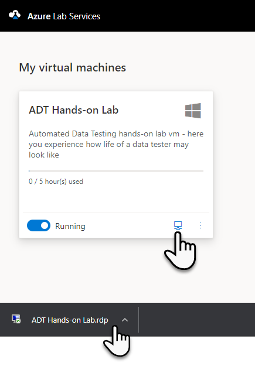

# Lab Registrace

Link pro přihlášení se do Azure Lab Services:

[Azure Lab Services](https://labs.azure.com/register/ctslp22s)

## 1.  Přihlaste se pod vaším Microsoft účtem (osobní nebo organizační)

## 2.  Vyčkejte, proběhne registrace do Labu

 

## 3.  Pokud jste v registraci uvedli nesprávný email objeví se následující 

Tento problém vyřešíme tím, že nám dáte vědět (ideálně do chatu) svů správný email vašeho Microsoft účtu (je jedno zda osobního či organizačního).

## 4.  V opačném případě se vám objeví vám dostupné Laby

-   Klikněte na náš lab - stáhne se vám .rdp soubor

-   Na tento klikněte také

-   Potvrďte další dialogy přihlášení

## 5.  Zadejte přihlašovací údaje

-   Vyberte \"more choices\"

-   Volbu \"Use a different account\"

-   A zadejte jméno a heslo

    -   Jméno: **tester**

    -   Heslo: **Superstar68**

 
## 6. Pokud vše dobře dopadne dorazíte do cíle!

 
