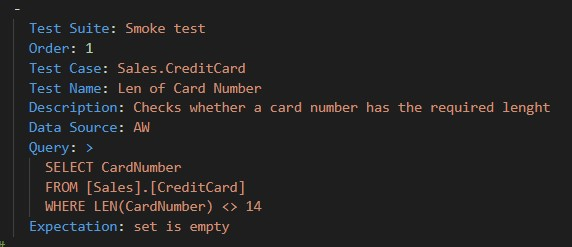
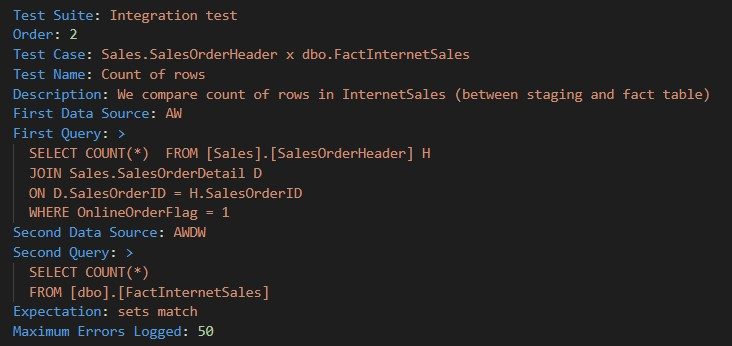

# Adventure Works Cycles - Sales

Pracujeme s databázemi **AdventureWorks2019** a **AdventureWorksDW2019**, které
shromažďují data o fiktivním nadnárodním výrobci jízdních kol a příslušenství Adventure
Works Cycles. Firma vznikla v roce 2010.

Data je potřeba testovat, protože jsou na jejich základě tvořena důležitá byznysová rozhodnutí. Klíčoví stakeholdeři a šéfové sales oddělení sepsali pro QA základní požadavky, které data musí splňovat.

V části A jsou uvedeny požadavky na Smoke testy, v části B jsou požadavky na integrační testy pro tabulky v databázi AdventureWorks2019 a Dim tabulky v databázi AdventureWorksDW2019. V části C jsou zadání pro tabulky v databázi AdventureWorks2019 a Fact tabulky v databázi AdventureWorksDW2019. Nakonec, v části D jsou uvedeny požadavky na generované testy.

Některé query jsou v zadání předvyplněné, takže stačí vytvořit testy v souboru ProjectFile.cat.yaml a zkopírovat je. 
Pokud si chcete psaní query vyzkoušet sami, můžete k tomu využít zadání, nebo si vymyslet vlastní testy podle vaší fantazie. :)

## Struktura Smoke testu

**Test Suite:** Název sady několika test cases, může být jakýkoli, například pod TestSuite zahrneme všechny Smoke testy.Toto pole není povinné.  
**Order:** Pořadí testu.Toto pole není povinné.   
**Test Case:** Název sady několika testů, může být jakýkoli, například název tabulky, pro kterou budeme tvořit více samostatných testů.Toto pole není povinné.   
**Name:** Název pro test, může být jakýkoli, ale měl by naznačovat, co je předmětem testu.  
Z TestSuite, Order, TestCase a TestName CAT složí celý název testu, takže bude vypadat například takto *[Smoke Sales].[1].[Sales.CreditCard].[Len of Card Number]*. 
Toto pole je povinné. Samotné jméno testu nemusí být unikátní, ale kombinace Test Suite, Order, Test Case a Name musí být jedinečná. 
**Description:** Krátký popis testu - všem by pak mělo být jasné, o co v testu jde, pokud bude zkoumat bug.Toto pole není povinné.  
**Data Source:** Název (alias) databáze nebo jiného zdroje dat, která chceme testovat. Jde o název, který jste definovali v Data Sources (AW nebo AWDW). Toto pole je povinné.  
**Query:** Samotný dotaz do databáze nebo jiného zdroje.Toto pole je povinné.  
**Expectation:** Pro Smoke testy v tomto případě používáme **Set is Empty**. Toto pole je povinné.

**Pro SMOKE testy můžeme použít následující očekávání, jejich výsledků:**

***Set is Empty:*** Očekávaný výsledek je, že dotaz vrátí prázdnou množinu. Pokud tomu tak není, test spadne.

***Set is not Empty:*** Očekávaný výsledek je, že dotaz něco vrátí. To je užitečné například v případě, že chceme ověřit, zda tabulky nejsou prázdné.

***Set RowCount:*** Při tomto typu testu si nastavíme počet řádků, které má dotaz vrátit. 

## Struktura Integračního testu

**Test Suite:** Název sady několika test cases, může být jakýkoli, například pod TestSuite zahrneme všechny Integrační testy.Toto pole není povinné.  
**Order:** Pořadí testu.Toto pole není povinné.  
**Test Case:** Název sady několika testů, může být jakýkoli, například názvy tabulek, pro které budeme tvořit více samostatných testů.Toto pole není povinné.  
**Name:** Název pro test, může být jakýkoli, ale měl by naznačovat, co je předmětem testu.  
 Z TestSuite, Order, TestCase a TestName CAT složí celý název testu, takže bude vypadat například takto *[Smoke Sales].[1].[Sales.CreditCard].[Len of Card Number]*. 
Toto pole je povinné. Samotné jméno testu nemusí být unikátní, ale kombinace Test Suite, Order, Test Case a Name musí být jedinečná. 
**Description:** Krátký popis testu - všem by pak mělo být jasné, o co v testu jde, pokud bude zkoumat bug.  
**First Query Source:** Název (alias) databáze nebo jiného zdroje dat, která chceme testovat. Jde o název, který jste definovali v Data Sources (AW nebo AWDW). Toto pole je povinné.  
**First Query:** Samotná query/dotaz do databáze nebo jiného zdroje.  
**Second Query Source:** Název (alias) databáze nebo jiného zdroje dat, která chceme testovat. Jde o název, který jste definovali v Data Sources (AW nebo AWDW). Toto pole je povinné.  
**Second Query:** Samotný dotaz do databáze nebo jiného zdroje.Toto pole je povinné.  
**Expectation:** Pro Integrační testy v tomto případě používáme **Sets match**. CAT tedy očekává, že výsledek First and Second Query bude stejný. Záleží na pořadí hodnot, proto používáme Order by.Pokud hodnoty nejsou stejné, test spadne. 
**Maximum Errors Logged:** CAT nam vypíše rozdíly mezi sety.

**Expectation:** contains  
Druhou možností integračních testů je porovnávat dva datasety, jako podmnožiny. Je to vhodné, pokud chceme zjistit, zda jsou všechna data z jednoho datasetu obsažena v tom druhém, ale přitom nejsou zcela shodná. Je to podobné jako SQL příkaz EXCEPT, ale lze ho použít i při porovnání, pokud jsou data v různých formátech. Oba data sety musí být seřazeny.  

## Struktura Generovaného testu

**Named Sets:** Toto pole pro CAT vytvoří metadata pro generované testy. Samotné metadata, pak definujeme následovně: 
**Name:** Název tohoto setu metadat.  
**Data Source:**  Název (alias) databáze nebo jiného zdroje dat, který chceme testovat. Jde o název, který jste definovali v Data Sources (AW nebo AWDW).  
**Query:** Dotaz, který vrátí hodnoty pro generování testů. Nejčastěji dotazujeme v databázi Information_Schema Table, Columns atd. Názvy sloupců, které dotaz vrátí, lze následně použít jako proměné v testovacím dotazu. V tomto případě jsou to TABLE_CATALOG, TABLE_SCHEMA, TABLE_NAME a TABLE_TYPE.

Druhá část těchto genrovaných testů je definována takto : 

**Name:** Název testu. I zde můžeme pomocí % % použít proměnné z metadat, takže se název testu dynamicky generuje.  
**Metadata:** Název (alias), který jsem použili definici metadat.   
**Description:** Krátký popis testu. 
**Data Source:**Název (alias) databáze nebo jiného zdroje dat, která chceme testovat. Jde o název, který jste definovali v Data Sources (AW nebo AWDW).  
**Query:** Samotný dotaz, kde místo klasické definice FROM použijeme proměnné z předchozích metadat. Díky tomu se tento test vygeneruje pro každou hodnotu, kterou vrátí dotaz definovany v Named Sets.

**Jak to funguje:** Nejprve jsme si pomocí dotazu do Information Schema vrátili seznam všech tabulek, a nyní tento seznam použijeme pro definovaný test. Test se proto vytvoří pro každou tabulku zvlášť.  
**Expectation:** Klasická definice toho co očekáváme, že test vrátí. 

# Zadání k tvorbě testů

Na konci dokumentu můžete najít informace o tabulkách v
AdventureWorks2019.

## A)  Smoke testy

| Testovací požadavek  | Název tabulky v databázi AdventureWorks2019  | Query  |
|-|-|-|
|Hodnoty ve sloupci CardNumber musí mít 14 znaků| [Sales].[CreditCard] |SELECT CardNumber   FROM [Sales].[CreditCard]   WHERE LEN(CardNumber) <> 14|
|Sloupec AccountNumber musí být vyplněn (nesmí být NULL)| [Sales].[Customer] | SELECT *   FROM Sales.Customer   WHERE AccountNumber IS NULL |
|Žádná hodnota ve sloupci LineTotal nesmí být 0 nebo NULL| [Sales].[SalesOrderDetail] | |
|Celková cena bonusů (suma sloupce Bonus) nesmí být větší než 50 000| [Sales].[SalesPerson] | |
|Tabulka SalesPersonQuotaHistory nesmí být prázdná| [Sales].[SalesPersonQuotaHistory] | SELECT COUNT(\*)   FROM Sales.SalesPersonQuotaHistory   HAVING COUNT(\*) = 0 |
|Jednotlivé odnoty 'Canadian GST' ve sloupci Name nesmí mít hodnotu TaxRate menší než 7| [Sales].[SalesTaxRate] | |
|Jednotlivé hodnoty 'Reseller' ve sloupci Category nesmí mít hodnotu DiscountPct vetší než 0.4| [Sales].[SpecialOffer] | |
|Pokud má OnlineOrderFlag v tabulce SalesOrderHeader hodnotu 0, způsob dopravy (Name v tabulce Purchasing.ShipMethod) musí mít hodnotu pouze 'CARGO TRANSPORT 5'| [Sales].[SalesOrderHeader], join [Purchasing].[ShipMethod] | SELECT SOH.OnlineOrderFlag, SOH.ShipMethodID, SM.Name   FROM [Sales].[SalesOrderHeader] SOH   JOIN Purchasing.ShipMethod SM ON SM.ShipMethodID = SOH.ShipMethodID   WHERE SOH.OnlineOrderFlag = 0 AND SM.Name NOT IN ('CARGO TRANSPORT 5')|
|Hodnoty ve sloupci OrderDate nesmí obsahovat datum starší než 2010 | [Sales].[SalesOrderHeader] | |

## B)  Integrační testy pro Dim tabulky

| Testovací požadavek  | Tabulka v AdventureWorks2019 | Tabulka v AdventureWorksDW2019 | Query AdventureWorks2019 | Query AdventureWorksDW2019 |
|-|-|-|-|-|
|Hodnoty ve sloupci Name v tabulce SalesTerritory musí být stejné jako hodnoty ve sloupci SalesTerritoryRegion v tabulce DimSalesTerritory| [Sales].[SalesTerritory] | [dbo].[DimSalesTerritory] | | |
|Hodnoty ve sloupcích Name a ReasonType v tabulce SalesReason musí být stejné jako hodnoty ve sloupcích SalesReasonName a SalesReasonReasonType v tabulce DimSalesReason, použijte HASH funkci | [Sales].[SalesReason] | [dbo].[DimSalesReason] | SELECT HASHBYTES('SHA1', Name + ReasonType)   FROM Sales.SalesReason   ORDER BY Name | SELECT HASHBYTES('SHA1', SalesReasonName + SalesReasonReasonType)   FROM [dbo].[DimSalesReason]   ORDER BY SalesReasonName |

## C)  Integrační testy pro Fact tabulky

| Testovací požadavek  | Tabulka v AdventureWorks2019 | Tabulka v AdventureWorksDW2019 | Query AdventureWorks2019 | Query AdventureWorksDW2019 | Poznámka |
|-|-|-|-|-|-|
|Součet LineTotal pro internetové objednávky v tabulce SalesOrderDetail musí být stejný jako součet SalesAmount v tabulce FactInternetSales| [Sales].[SalesOrderHeader], join [Sales].[SalesOrderDetail] | [dbo].[FactInternetSales] | SELECT SUM(D.LineTotal)   FROM [Sales].[SalesOrderHeader] H   JOIN Sales.SalesOrderDetail D ON D.SalesOrderID = H.SalesOrderID   WHERE H.OnlineOrderFlag = 1; | SELECT SUM(SalesAmount) AS TotalOnlineSales   FROM [dbo].[FactInternetSales]; | Tabulka SalesOrderDetail se musí spojit se SalesOrderHeader, internetové objednávky indikuje hodnota 1 ve sloupci OnlineOrderFlag |
|Počet řádků internetových objednávek v tabulce SalesOrderDetail se musí rovnat počtu řádků v tabulce FactInternetSales | [Sales].[SalesOrderHeader], join [Sales].[SalesOrderDetail] | [dbo].[FactInternetSales] | | | Tabulka SalesOrderDetail se musí spojit se SalesOrderHeader, internetové objednávky indikuje hodnota 1 ve sloupci OnlineOrderFlag |
|Součet sloupce LineTotal za jednotlivé oblasti (internetové objednávky) musí být stejný jako součet SalesAmount v tabulce FactInternetSales za jednotlivé oblasti | [Sales].[SalesOrderHeader], join [Sales].[SalesOrderDetail], join [Sales].[SalesTerritory] | [dbo].[FactInternetSales], join [dbo].[DimSalesTerritory] | SELECT T.Name, SUM(D.LineTotal) AS SumLineTotal   FROM [Sales].[SalesOrderHeader] H JOIN Sales.SalesOrderDetail D ON D.SalesOrderID = H.SalesOrderID   JOIN Sales.SalesTerritory T ON T.TerritoryID = H.TerritoryID   WHERE H.OnlineOrderFlag = 1   GROUP BY T.Name ORDER BY T.Name; | SELECT T.SalesTerritoryRegion, SUM(S.SalesAmount) AS SumSalesAmount   FROM [dbo].[FactInternetSales] S   JOIN dbo.DimSalesTerritory T ON T.SalesTerritoryKey = S.SalesTerritoryKey   GROUP BY T.SalesTerritoryRegion   ORDER BY T.SalesTerritoryRegion; | Tabulka SalesOrderDetail se musí spojit se SalesOrderHeader, internetové objednávky indikuje hodnota 1 ve sloupci OnlineOrderFlag. Oblasti najdete ve sloupci Name v tabulce Sales.SalesTerritory a ve sloupci SalesTerritoryRegion v dbo.DimSalesTerritory | 
|Součet sloupce LineTotal za jednotlivé produkty (internetové objednávky) musí být stejný jako součet SalesAmount v tabulce FactInternetSales za jednotlivé produkty | [Sales].[SalesOrderHeader], join [Sales].[SalesOrderDetail], join [Production].[Product] | [dbo].[FactInternetSales], join [dbo].[DimProduct] | | | Tabulka SalesOrderDetail se musí spojit se SalesOrderHeader, internetové objednávky indikuje hodnota 1 ve sloupci OnlineOrderFlag. Produkty najdete ve sloupci Name v tabulce Production.Product a ve sloupci EnglishProductName v dbo.DimProduct|
|Zkontroluj, že v tabulce FactInternetSales, jsou správné ProductKey. Údaje je třeba porovnat s hodnoty v tabulce DimProduct.| |FactInternetSales vs DimProduct | | |Tento test lze řešit více způsoby, ale zkuste si na něm vyzkoušet Expectation: Contains ||||

## D) Generování testů na základě metadat

| Testovací požadavek | AW nebo ADWH | Query | Poznámka |
|---------------------|-----------------------------|--------------------------|----------|
| Vygenerujte testy pro všechny tabulky se schématem Sales. Tento test bude kontrolovat, že tabulky nejsou prázdné. | Využít můžete INFORMATION_SCHEMA.TABLES v AW | |Samotný test bude  dotaz, který vybere vše z dané tabulky. Použít lze Expectation: Set is not Empty|
|Vygnerujte testy pro všechny  sloupečky, které mají v názvu Key a nacházejí se v DIM nebo FACT tabulkách. Poté napište test,který zkontroluje, že tyto sloupce neobsahuji nullové hodnoty. | INFORMATION_SCHEMA.columns V ADWH | |Samotný test bude používat jméno sloupce a tabulky z metadat|

## Přehled tabulek za oddělení Sales v databázi AdventureWorks2019
|Table Name|Description|
|-|-|
  |Sales.CountryRegionCurrency         |Cross-reference table mapping ISO currency codes to a country or region.|
  |Sales.CreditCard                    |Customer credit card information.|
  |Sales.Currency                      |Lookup table containing standard ISO currencies.|
  |Sales.CurrencyRate                  |Currency exchange rates.|
  |Sales.Customer                      |Current customer information. Also see the Person and Store tables.|
  |Sales.PersonCreditCard              |Cross-reference table mapping people to their credit card information in the CreditCard table|
  |Sales.SalesOrderDetail              |Individual products associated with a specific sales order. See SalesOrderHeader.|
  |Sales.SalesOrderHeader              |General sales order information.|
  |Sales.SalesOrderHeaderSalesReason   |Cross-reference table mapping sales orders to sales reason codes.|
  |Sales.SalesPerson                   |Sales representative current information.|
  |Sales.SalesPersonQuotaHistory       |Sales performance tracking.|
  |Sales.SalesReason                   |Lookup table of customer purchase reasons.|
  |Sales.SalesTaxRate                  |Tax rate lookup table.|
  |Sales.SalesTerritory                |Sales territory lookup table.|
  |Sales.SalesTerritoryHistory         |Sales representative transfers to other sales territories.|
  |Sales.ShoppingCartItem              |Contains online customer orders until the order is submitted or cancelled.|
  |Sales.SpecialOffer                  |Sale discounts lookup table.|
  |Sales.SpecialOfferProduct           |Cross-reference table mapping products to special offer discounts.|
  |Sales.Store                         |Customers (resellers) of Adventure Works products.|

## Schéma tabulek v databázi AdventureWorks2019

## Schéma tabulek v databázi AdventureWorksDW2019
